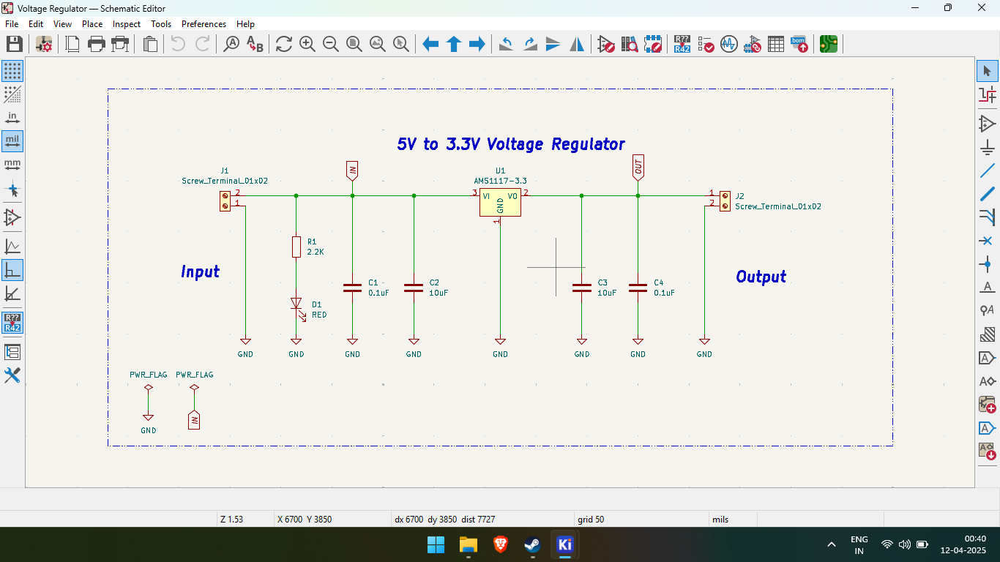
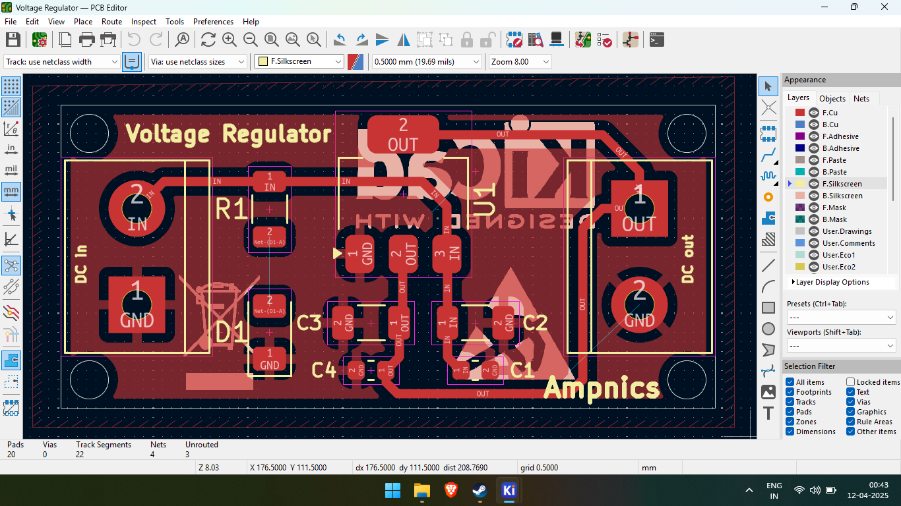
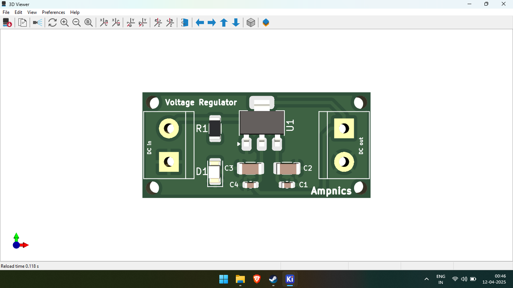

# ⚡ 5V to 3.3V Voltage Regulator PCB

## 📌 Overview  
This is a **PCB design** for a **5V to 3.3V Voltage Regulator**, created using **KiCad**. The circuit is based on the **AMS1117-3.3V** voltage regulator and is ideal for powering low-voltage components such as ESP modules and 3.3V sensors.

## 🛠️ Specifications  
- **Input Voltage**: 5V DC  
- **Output Voltage**: 3.3V DC (regulated)  
- **Regulator IC**: AMS1117-3.3V  
- **Indicators & Filtering**:  
  - **Input Side**:  
    - LED with 2.2KΩ resistor (for power indication)  
    - 0.1µF and 10µF capacitors in parallel  
  - **Output Side**:  
    - 10µF and 0.1µF capacitors in parallel  
- **Screw Terminals**: For clean 5V input and 3.3V output connections  

## 📂 Project Files  
- **Schematics** → `/Schematics/`  
- **PCB Layout** → `/PCB_Design/`  
- **Gerber Files** → `/Gerber_Files/` (for manufacturing)  
- **Images** → `/Images/` (renders & screenshots)  

## 🖼️ Preview Images  
| Schematic | PCB Layout | 3D Render |
|-----------|------------|-----------|
|  |  |  |

## 🔧 How to Use  
1️⃣ **Open the KiCad files** in `/Schematics/` and `/PCB_Design/`.  
2️⃣ **Customize the design** if needed and generate Gerber files for fabrication.  
3️⃣ **Use the Gerber files** in `/Gerber_Files/` to place an order with your preferred PCB manufacturer.  

## 🙏 Credits  
This project was created with the help of tutorials from the **[Ampnics YouTube Channel](https://youtube.com/playlist?list=PLxgq6Jtu7shQPHqYjKUVa28CmktTzHDLp&si=2TdaJywcDumlzVk_)**. Big thanks for their awesome content!

## 🔗 Links  
- 🚀 **Project Discussion on LinkedIn**: [LinkedIn](https://www.linkedin.com/posts/ramu-roy-b780382b7_pcbdesign-ams1117-voltageregulator-activity-7317076914295209984-Q4_r?utm_source=social_share_send&utm_medium=android_app&rcm=ACoAAEwAX4wBY70YZ3l58lvkiXtyCZcnWWrfJAA&utm_campaign=copy_link)  
- 📺 **Ampnics Tutorial Playlist**: [YouTube](https://youtube.com/playlist?list=PLxgq6Jtu7shQPHqYjKUVa28CmktTzHDLp&si=jp1xYo7E0JcdnXuT)

## 📜 License  
This project is licensed under the **MIT License** – feel free to use, share, and modify it!
